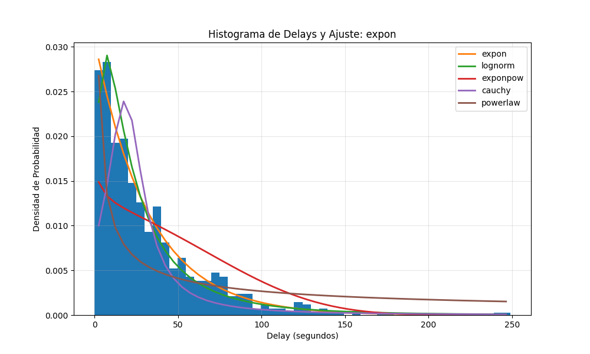

### Construcción de la variable cambio de tiempo 

A partir de la tabla registros_mqtt se trabajó con la columna timestamp para construir la variable aleatoria de interés, por lo que se utilizó la variable del tiempo

$$
\Delta t = t_i - t_{i-1}
$$

Seguidamente, se observa la comparación de momentos estadísticos.

## Resultados Finales – Comparación de Momentos Estadísticos

| **Estadístico** | **Datos Reales** | **Modelo Ajustado** |
|-----------------|------------------|----------------------|
| Media           | 32.404566        | 32.404566            |
| Varianza        | 1074.033736      | 1047.838449          |
| Asimetría       | 2.039514         | 2.000000             |
| Curtosis        | 6.223322         | 6.000000             |

A partir de la distribución de los tiempos entre eventos consecutivos, se observa un comportamiento consistente con un patrón estocástico típico de procesos donde los sucesos ocurren de manera independiente en el tiempo. Antes de realizar las pruebas de ajuste, ya era posible intuir que la forma de los datos sugería un modelo probabilístico perteneciente a la familia de distribuciones de cola positiva, como la exponencial o la gamma.

Al comparar la distribución empírica con distintos modelos teóricos, se confirma esta impresión inicial. Los histogramas muestran una concentración mayor de valores cercanos a cero y una disminución progresiva conforme los tiempos aumentan, lo cual es característico de distribuciones utilizadas para modelar tiempos de espera. La curva teórica seleccionada a partir de las pruebas de bondad de ajuste se aproxima de forma adecuada a la densidad observada en los datos, lo que valida su pertinencia como modelo para describir el fenómeno.

Identificar con precisión la distribución que mejor representa estos intervalos es fundamental, ya que permite estimar la probabilidad de que ocurran eventos con diferentes niveles de retraso. Este tipo de análisis no solo ofrece una comprensión más profunda del comportamiento temporal del sistema, sino que también constituye una herramienta clave para procesos de decisión en áreas como la analítica de datos, la predicción operativa y la optimización de sistemas en tiempo real.

Por último, se puede observar en la siguiente figura el histograma con las curvas de ajuste correspondientes:

